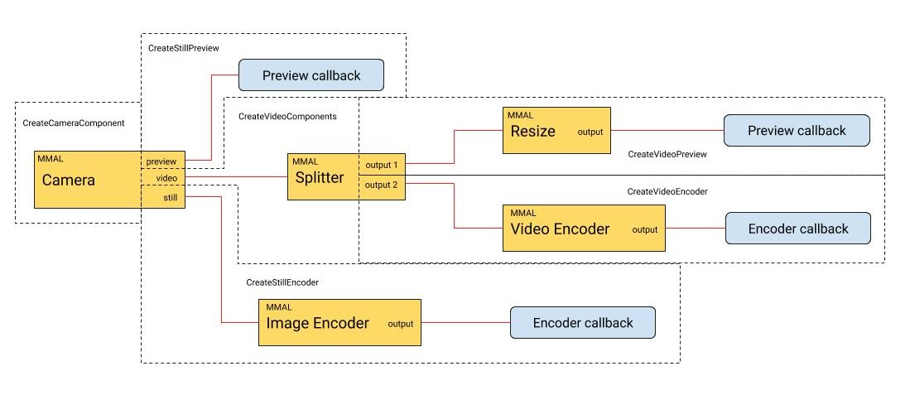

# RekkonMMALCamera

The purpose RekkonMMALCamera is to provide an easy access to the functionnality offered by the camera module of the raspberry pi in C++.
The library use the MMAL API mainly and the schema of the components are as follows:

The recommended resolution for the preview component are 540p (960\*540 | 16/9) for the video and 1MPx (1152\*864 | 4/3) if you want 30 frames per seconds. This is due to hardware limitation in the convertion from yuv420 to rgb / bgr. You can go in higher resolution at your own risks. just remember that due to process architecture, video preview cannot be at higher resolution that video record.

# Work in Progress

- [x] Add Still preview support.
- [x] Add Still record support.
- [ ] Comment clearly videommalobject code
- [ ] Add exceptions support
- [ ] Add customization options for the camera output
  - [ ] add customization for JPEG encoder
  - [ ] add customization for H264 encoder
  - [ ] add other encoder support
- [ ] add some post processing filter?

# Resources used

https://github.com/rmsalinas/raspicam

http://www.jvcref.com/files/PI/documentation/html/

https://picamera.readthedocs.io/en/release-1.13/api_mmalobj.html

https://github.com/raspberrypi/userland/blob/master/host_applications/linux/apps/raspicam/RaspiStill.c

https://github.com/raspberrypi/userland/blob/master/host_applications/linux/apps/raspicam/RaspiVid.c